## Corn Leaf Disease Classification

The United States is the largest producer of corn in the world. As a staple crop, corn plays a
large role in the economy as a key ingredient in many manufactured goods including non-food products. Being able to differentiate between healthy corn leaves and different diseases early on can allow for quick and effective treatment, mitigating any potential losses or food security issues. Here we examine images of corn leaves that have been affected by either Blight, Common Rust, Gray Leaf Spot, or are Healthy. The goal of this analysis is to create a Convolutional Neural Network(CNN) that is able to classify different corn diseases based on labeled images.

## Who Would Find this Analysis Useful?

Corn is the largest grain export of the United States with over 18 Billion USD in export value in 2021. As such, a large part of the population live in economies revolving around corn or within adjacent industries. Specifically corn farmers, many of whom reside in the mid-west would find this analysis useful in order to quickly and effectively eliminate diseases that would cripple their crop. Players in corn adjacent industries such as giant food and beverage corporations like Pepsi-Co, Nestle, Coco-Cola, and Kellog's or those in the energy industry such as Exxon, whose products use many corn derivatives would be interested in ensuring their supply remain steady.

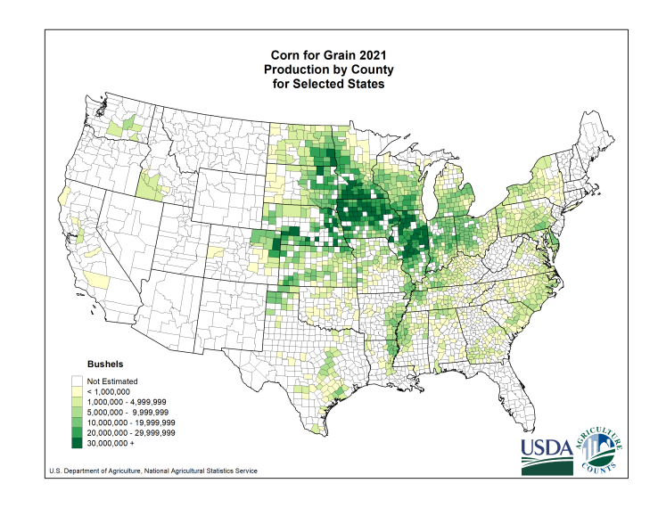

## 0. Data
---

This dataset has been made from a combination of images from the PlantDoc and PlantVillage datasets.
PlantDoc images were webscraped and manually labeled while PlantVillage images are taken mostly within laboratory settings. In total, we have 4188 images from 4 different classes. 1146 images in the Blight class, 1306 images in the Common Rust class, 574 images in the Gray Leaf Spot class, and 1162 images in the Healthy class. The images are all 3 channel RGB jpeg images but have varying dimensions. The images often have varying backgrounds, lightning, show part of a leaf or multiple plants. Some images are partially occluded by human fingers. The dataset and associated papers are linked below.

* [Corn Leaf Dataset](https://www.kaggle.com/datasets/smaranjitghose/corn-or-maize-leaf-disease-dataset)

* [PlantDoc Paper](https://arxiv.org/pdf/1911.10317.pdf)

* [PlantVillage Dataset](https://www.kaggle.com/datasets/emmarex/plantdisease?datasetId=70909&sortBy=voteCount)

* [Project Data](https://github.com/clementchen163/Corn-Leaf-Disease/tree/main/0.%20Project%20Data)

## 1. Data Wrangling and Exploratory Data Analysis
---
[Data Wrangling and Exploratory Data Analysis Report](https://github.com/clementchen163/Corn-Leaf-Disease/blob/main/1.%20Data%20Wrangling%20and%20EDA/Data%20Wrangling%20and%20EDA.ipynb)

Our data consist of 4188 RGB jpeg images with dimensions ranging from 116-5134 pixels. Because convolutional nueral networks require input images be of the same size in order for the matrix math to work properly, we need to modify our images before training. As we can see below, the raw images are of varying dimensions:


#### Image Width and Height Distributions

We can see from the histograms below that an overwhelming majority of the images have a height or width of 256 pixels.

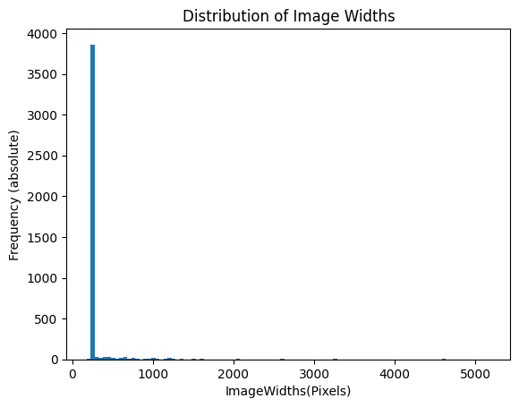

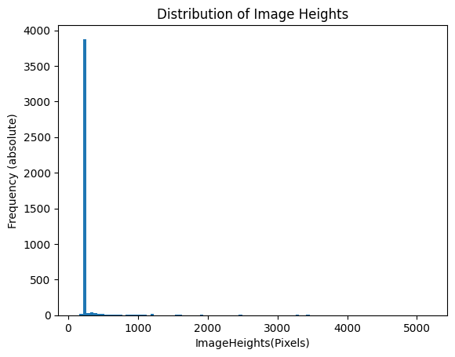

It turns out that ~ 92.3% of our images have a width of 256 pixels or less
and ~ 92.7% of our images have a height of 256 pixels or less
with ~ 92.0% of images have a height and width equal to 256 pixels.

Since so many of our images have dimensions of 256 x 256, maybe it would make sense to use those dimensions for inputing into our CNN. 
But what about the dimensions of all the images that aren't 256 x 256? Below we have a scatter plot of image height and width for images without the 256 x 256 dimensions. The red line is the line of equality. We can see that the majority of the non 256 x 256 images are "near-square" because of their proximity to the line of equality. Almost all of the images have at least one dimension larger than 256 pixels. Because larger image sizes would require more computational resources to train the model, it would make most sense to downscale these images to be 256 x 256 as this would have the least negative impact because most images are already at this resolution or are near-square.

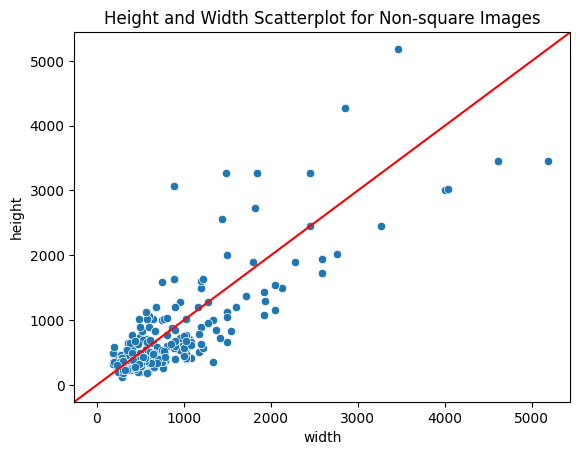

#### Image Resizing

We can see that input images have varying width and height dimensions. However, Covolutional Neural Networks (CNNs) require that input images all be of the same size in order for the matrix math to work correctly. There are several options to satisfy these requirements although some may have negative effects on training.

• **Cropping**

Cropping images means selecting a window size and centering it around the most important parts of the image. This introduces some new problems: deciding what part of the image is most important as well as the fact that certain border pixels are going to be removed resulting in potential loss of information. In addition, the wide variety of image dimensions (116 pixels to 5184 pixels) means a cropping widow for one image might not work as well for another image.
    
• **Stretching**

Stretching images means stretching or squashing the image to reach the desired dimensions. This results in less loss of information than cropping but features may be distorted. If the image is squashed, some information is loss due to the reduction in granularity. For both stretching and squashing, the relative spatial orientation of pixels becomes distorted which could interfere with the CNN's ability to discern important features.
    
• **Zero-padding**

Zero-padding is our last solution and keeps original image aspect ratio. In order to convert each image to the same size, images are first upscaled or downscaled until the longest dimension is 256 pixels (or whatever you choose) while maintaining the aspect ratio. Pixels of 0's are then filled around the shorter side's border to make the resulting image square. A 2019 [study](https://journalofbigdata.springeropen.com/articles/10.1186/s40537-019-0263-7) showed that "zero-padding had no effect on the classification accuracy but considerably reduced the training time. The reason is that neighboring zero input units (pixels) will not activate their corresponding convolutional unit in the next layer. Therefore, the synaptic weights on outgoing links from input units do not need to be updated if they contain a zero value."


**Zero-padding** seems like the best solution.

#### Resizing and Zero-Padding

For images not at 256 x 256, we first need to resize them by upscaling or downscaling while maintaining the aspect ratio to prevent stretching or squeezing that could destroy important features. Then to make the image square, we zero-pad the sides with black pixels ((0, 0, 0) in RGB). Below are some example images after resizing and zero-padding. The aspect ratios are maintained so the images are not distorted but fit our requirement of all being of size 256 x 256.

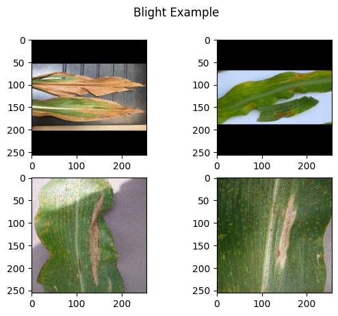

#### Class RGB Image Averages

After rescaling and zero-padding all of our images, it is now possible to average our images by taking the elementwise mean. By averaging the images within each class, we lose certain information such as locations of specific translationally variant features like spots or miscolored stripes. However, we can see the shading of different colors between the classes. The most notable difference is between the diseased classes of Blight, Common Rust, Gray Leaf Spot which all have a dark brownish green color versus the Healthy class which has a much brighter vibrant green. A simpler binary classification task of labeling diseased versus healthy leaves could yield very good results as these classes have very different easily seperarble color schemes as shown below. 

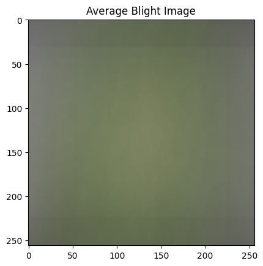

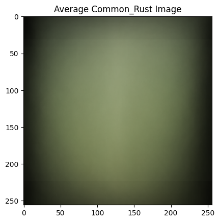

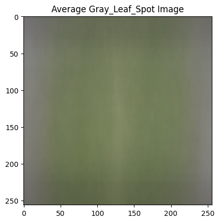

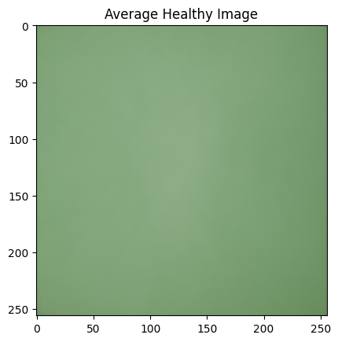

## 2. Preprocessing and Modeling
---
[Preprocessing and Modeling Report](https://github.com/clementchen163/Corn-Leaf-Disease/tree/main/2.%20Preprocessing%20and%20Modeling)

#### Data Augmentation 

Data augmention is the process of using existing data, augmenting it slightly to create 'new' instances. This can help increase the number of data examples to train from reducing overfitting. For our CNNs, we place a data augmention layer after the input which randomly applies a horizontal flip, rotates the images up to +/- 10° and zooms in or out by up to +/- 20%. By doing this, one image can be augmented into many other, slightly different images as shown below:

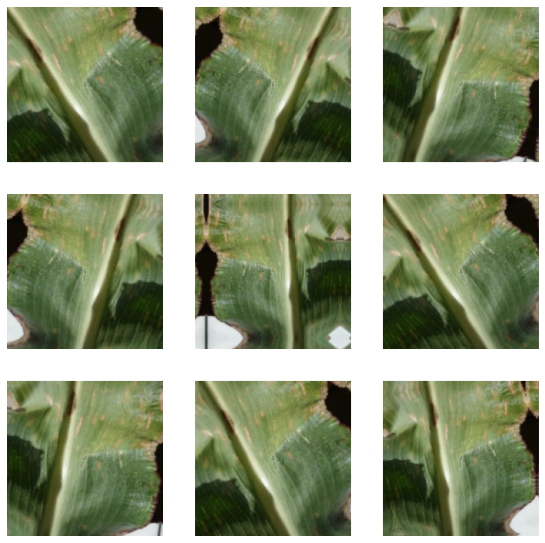

## Original Data vs Zero-Padded Data

To demonstrate the effectiveness of the reshaped and zero-padded data, we train 2 basic CNNs, one using the raw original data that has been stretched so all images are the same size, and the second using the reshaped and zero-padded data we engineered. Both CNNs use the same architecture shown below:

>* Input Images
>
>* Data Augmentation
>
>* Rescaling Pixel Values from [0-255] to [0-1]
>
>* Convolutional Layer (filters = 32, kernel_size = 3, activation = 'relu')
>
>* Max Pooling Layer (pool_size = 2)
>
>* Convolutional Layer (filters = 64, kernel_size = 3, activation = 'relu')
>
>* Max Pooling Layer (pool_size = 2)
>
>* Convolutional Layer (filters = 128, kernel_size = 3, activation = 'relu')
>
>* Max Pooling Layer (pool_size = 2)
>
>* Convolutional Layer (filters = 256, kernel_size = 3, activation = 'relu')
>
>* Max Pooling Layer (pool_size = 2)
>
>* Convolutional Layer (filters = 256, kernel_size = 3, activation = 'relu')
>
>* Flatten
>
>* Densely Connected Layer (units = 4, activation = 'softmax')


#### Original Data Model

The CNN using the original data reaches a validation accuracy of ~ 90% before starting to overfit around epoch 65.

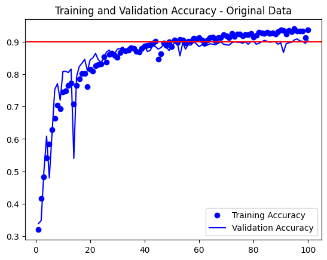

#### Zero-Padded Data Model

The same CNN but trained on the reshaped and zero-padded data reaches a validation accuracy of ~93% before starting to overfit around epoch 75. What this tells us is that the zero-padded data has more potential for higher accuracy but is slower to learn with. Maybe we can fix this weakness of the zero-padded data by using part of a pretrained CNN model.

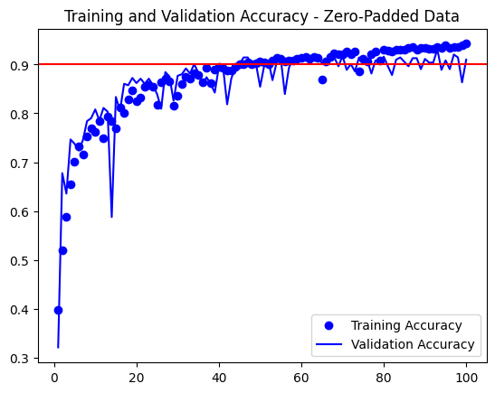

## Transfer Learning Model

We see in our previous models that it takes quite a few epochs before the models start overfitting which means our model takes quite some time to learn the "generic features of the visual world" before it can then learn how to classify the different corn diseases. Here we use part of a pre-trained CNN model(VGG16) that has been trained on the ImageNet dataset which contains over 14 million images. The plan is to take the convolutional base from the VGG16 model which has learned some small features general to the visual world and discard the densely connected classification layers which have been tuned to classify animals and other objects. In its place we would train our own densely connected layers to tailor its application to our corn leaf disease classification task. So ontop of the convolutional base, we add some densely connected layers along with a dropout layer with a softmax activation function output layer. Before we start any training, we freeze the weights on the convolutional base because if we don't, the randomly initialized weights of the densely connected layers will backpropogate and destroy all the learning from our pretrained convolutional base once we begin training.

#### The Convolutional Base of the VGG16 Model

The convolutional base has repeating blocks in a pyramid-like structure. The repeated blocks have a  general conv-conv-pooling structure which have increasingly many filters. The weights and filters in these layers are frozen so that the backpropagation from the randomly initalized weights of the densely connected layers don't destroy the learning already in the convolutional layer.

>* Input Images
>
>* Data Augmentation
>
>* Rescaling Pixel Values from [0-255] to [0-1]
>
>* Convolutional Layer (filters = 64, kernel_size = 3, activation = 'relu')
>
>* Convolutional Layer (filters = 64, kernel_size = 3, activation = 'relu')
>
>* Max Pooling Layer (pool_size = 2)
>
>* Convolutional Layer (filters = 128, kernel_size = 3, activation = 'relu')
>
>* Convolutional Layer (filters = 128, kernel_size = 3, activation = 'relu')
>
>* Max Pooling Layer (pool_size = 2)
>
>* Convolutional Layer (filters = 256, kernel_size = 3, activation = 'relu')
>
>* Convolutional Layer (filters = 256, kernel_size = 3, activation = 'relu')
>
>* Convolutional Layer (filters = 256, kernel_size = 3, activation = 'relu')
>
>* Max Pooling Layer (pool_size = 2)
>
>* Convolutional Layer (filters = 512, kernel_size = 3, activation = 'relu')
>
>* Convolutional Layer (filters = 512, kernel_size = 3, activation = 'relu')
>
>* Convolutional Layer (filters = 512, kernel_size = 3, activation = 'relu')
>
>* Max Pooling Layer (pool_size = 2)

#### Densely Connected Layers

The densely connected layers has inbetween them a dropout of 10% to prevent over fitting.

>* Flatten
>
>* Densely Connected Layer (units = 256))
>
>* Dropout (rate = 0.1)
>
>* Densely Connected Layer (units = 4, activation = 'softmax')

We can see that with the pretrained model, the accuracy starts very high in the low 90s and begins over fitting almost immediately. What this tells us is that even with randomly initalized weights in the densely connected layers, by the 4th epoch, we reach a validation accuracy of ~93%. This means our convolutional base taken from the pretrained model is doing very well. What we need to do now is optimize the hyperparameters of our densely connected layers and try to get some model improvement.

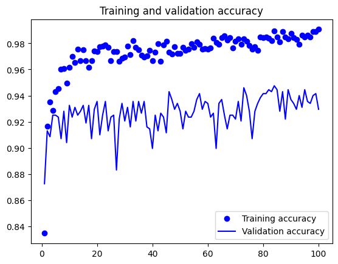

## Hyperparameter Tuning of the Transfer Model

The above results of the inital transfer model look promising. The densely connected and dropout layers we added on top of the convolutional base had hyperparameters chosen arbitrarily. We can choose better ones by doing some hyperparameter tuning. 

Due to limited computational resources, the hyperparameter search space will be restricted to the number of nodes in the first dense layer in the range (128, 512) in steps of 32 as well as dropout percentage in the range (0.1, 0.5) in steps of 0.2 with a total of 39 possible combinations.

With a selected pair of search hyperparameters, a model is trained and evaulated using validation data and the next pair of search hyperparameters are chosen using a bayesian optimization algorithm.

After going through the search space, our best model had hyperparameters with 128 units in the first densely connected layer and a dropout of 0.5. Both these values are at the limits of their respective search space which leads me to believe we may have reached a local optima and not the global optima due to inital restrictions on our search space. Due to lack of computational resources (it takes a long time to search through hyperparameters) we will continue forward but this could be room for future improvement. 

#### Top 5 Hyperparameter Models

With the top 5 hyperparameter models we obtained from the search, we want to optimize the number of epochs that these models train for. Training for too many epochs could lead to overfitting on the training data especially with the transfer model having such a strong convolutional base. Looking back we can see how quickly the transfer learning model starts overfitting. So we take these 5 hyperparameters and retrain them again but this time looking for an optimal number of training epochs. Below we have the training histories of each of the 5 chosen models (1 being the best and 5 worst).

Model 1 reaches a peak validation accuracy of ~95% before overfitting around epoch 16

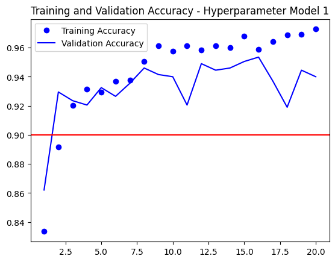

Model 2 reaches a peak validation accuracy of ~95% before overfitting around epoch 13

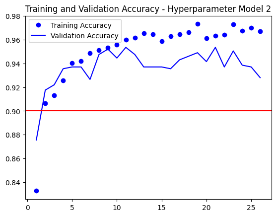

Model 3 reaches a peak validation accuracy of ~93% before overfitting around epoch 10

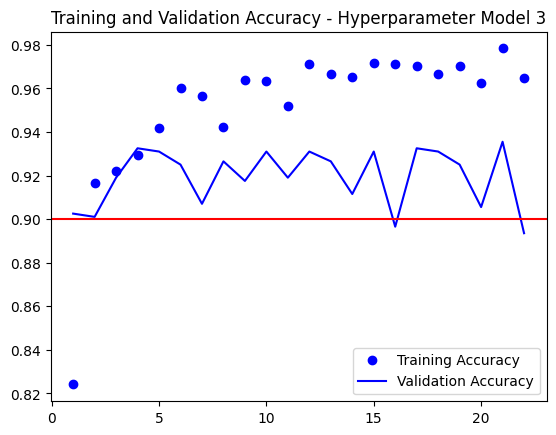

Model 4 reaches a peak validation accuracy of ~94% before overfitting around epoch 8

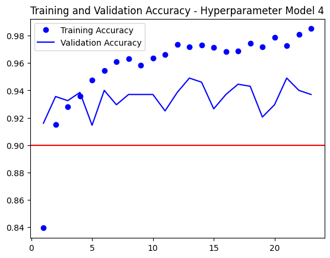

Model 5 reaches a peak validation accuracy of ~95% before overfitting around epoch 15

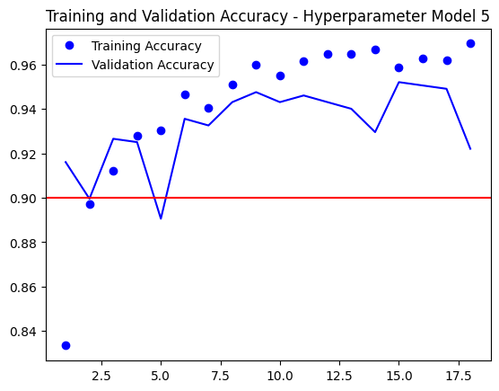

Once we get the best number of epochs, we retrain the 5 models one last time with their hyperparameters and best number of epochs. We use the combined training and validation set just so we can have the model see more data (we no long have a need for the validation set). Because more data is being used, we allow for the models to train for (1.1 * best # of epochs).

## 3. Model Selection
---
[Model Selection Report](https://github.com/clementchen163/Corn-Leaf-Disease/blob/main/3.%20Model%20Selection/Model%20selection.ipynb)


We have 8 models to evaluate using the test sets. Only one model, the 'Base CNN Org Data', uses the raw unprocessed data. The rest of the models use the zero-padded data.
* Base CNN Org Data
* Base CNN Zero-Pad
* Transfer Learning Zero-Pad
* Hypermodel1 Zero-Pad
* Hypermodel2 Zero-Pad
* Hypermodel3 Zero-Pad
* Hypermodel4 Zero-Pad
* Hypermodel5 Zero-Pad

#### Model Results

| Model Name                 | f1 Score | Test Accuracy | Precision | Recall | Winner  |
| :------------------------- | :------: | :-----------: | :-------: |:------:|:------: |
| Base CNN Org Data          | 0.892    | 0.891         | 0.895     | 0.891  | ❌     |
| Base CNN Zero-Pad          | 0.900    | 0.902         | 0.902     | 0.902  | ❌     |
| Transfer Learning Zero-Pad | 0.898    | 0.900         | 0.901     | 0.900  | ❌     |
| Hypermodel1 Zero-Pad       | 0.936    | 0.937         | 0.937     | 0.937  | tied✅ |
| Hypermodel2 Zero-Pad       | 0.937    | 0.937         | 0.937     | 0.937  | tied✅ |
| Hypermodel3 Zero-Pad       | 0.910    | 0.906         | 0.919     | 0.906  | ❌     |
| Hypermodel4 Zero-Pad       | 0.846    | 0.864         | 0.879     | 0.864  | ❌     |
| Hypermodel5 Zero-Pad       | 0.924    | 0.922         | 0.932     | 0.922  | ❌     |

We can see from the results of the Base CNN models that the zero-padded data slightly outperformed the original data. The Transfer Learning model trained much faster than the Base CNN models but performed about as well on the test sets. However, after hyperparameter tuning of the Transfer Learning model, the winning models had a 4% increase in all metrics.

The winning models 1 and 2 had hyperparameters of 128 units and 160 units respectively in the densely connected layer and both had a dropout percentage of 50%.

#### Confusion Matrices of Winning Models

From the confusion matrix of the test data, we can see that the majority of the misclassifications are between the disease classes of Blight, Common_Rust, and Gray_Leaf_Spot. Some of this could be due to misclassification of the true labels due to human error when constructing the dataset. 

The worse predicted class was Gray_Leaf_Spot with ~23% of its images being misclassified as Blight. This is probably due to the class imbalance where there exists a 0.27, 0.31, 0.14, 0.28 proportion between the Blight, Common_Rust, Gray_Leaf_Spot, Healthy class instances respectively. With Gray_Leaf_Spot having half as many instances as the other class, the model we created which optimized based on accuracy, didn't value misclassifying Gray_Leaf_Spot as much as the other classes. 

The true Healthy class instances were all predicted correctly. If our classification goal was simplified to identifying diseased vs healthy corn leaves, our current models would have 100% accuracy.


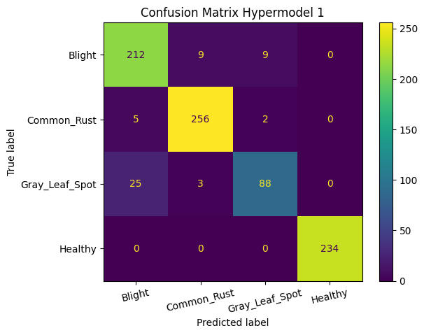

#### Fitted Models

Fitted models were saved using 2 files: a .json containing model architecture and a .h5 containing model weights.

[Fitted Models for Future Predictions](https://github.com/clementchen163/Corn-Leaf-Disease/tree/main/3.%20Model%20Selection/saved_models)


## 4. Conclusions and Future Research
---

#### Conclusion

In summary, for our corn leaf classification task of differentiating between differnt corn diseases, we have trained 8 convolutional neural networks. We found out that preprocessing the data by reshaping and zero-padding it performed better than using squashing or stretching to resize images. 

Our base CNN took many epochs before overfitting demonstrating that our model was doing a very slow job at learning. We then took the convolutional base of the VGG16 model that had already been trained on millions of images and just added a few dense layers and a dropout layer ontop. The reasoning behind this is that we are modeling real world objects (corn leaves) and a model like VGG16 "act[s] as a generic model of the visual world and hence, its features can prove useful for many different computer vision problems, even though these new problems may involve completely different classes than those of the original task." After implementing the pretrained model we saw the validation accuracy reach 93% after only 4 epochs. However, overall performance was not improved much.

We then used hyperparameter tuning searching over number of units in the densely connected layer and dropout percentage in the dropout layer. The best models in this search had validation accuracy reaching 95%, a large improvement over the previous models. From the 2 winning models, both perfectly classified all instances of the Healthy class and had none of of the diseased classes mislabeled as Healthy. If our classification goal was simplified to the binary case of identifying diseased vs healthy corn leaves, our current models would have 100% accuracy (and consequently 100% precision and recall).

With this analysis and the chosen models, farmers as well as companies whose products are reliant on corn derivatives will have peace of mind knowing that they are able to quickly and effectively identify and combat corn diseases that would otherwise cripple the crop. 

#### Ideas for Future Research

Streamline corn leaf image gathering
* Possibly use satillite imagery or drones
* Image segmentation on raw data to isolate pictures of corn leaves
---

Change CNN model architecture
* Residual connections
* Batch normalization
* Model a binary classification task
---

Acquire more computational resources to search a broader hyperparameter space
* Number of densely connected layers
* Number of units per layer
* Optimizers such as adam or sgd
---

Acquire better and more training data
* More Gray Leaf Spot class instances to balance dataset
* Make sure images are labeled correctly
* Foreground and background segmentation
* Avoid or work arround corn leaf occulsion in images
---


```python

```
